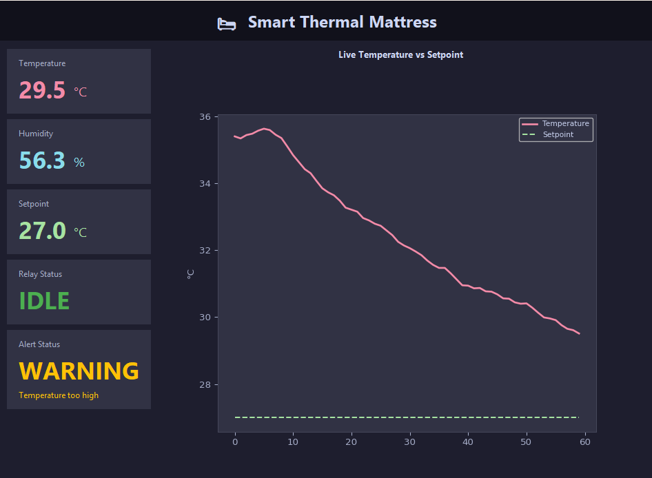

# HeatSync — IoT Smart Home

## Personalized Adaptive Thermal Mattress

| | |
|---|---|
| **Institution** | Holon Institute of Technology (HIT) — Faculty of Sciences |
| **Department** | Computer Science |
| **Course** | Software Development for IoT Systems in Smart City Environment |
| **Students** | Liel Cochabi · Rachel Brodsky |
| **Supervisor** | Mr. Yury Yurchenko |
| **Semester** | Spring תשפו |

---

## Project Overview
A simulated IoT system that monitors and controls a smart thermal mattress. The system
continuously reads temperature and humidity from an emulated DHT sensor, compares readings
against a user-defined comfort setpoint, and automatically activates a heating or cooling relay.
All data is persisted to SQLite and visualized through a live Tkinter & Matplotlib GUI.

## Keywords
`Internet of Things (IoT)` `Smart Home` `Simulation` `Adaptive Temperature Control`
`MQTT Protocol` `Real-time Systems` `Thermal Mattress` `Pub/Sub` `Python` `SQLite`

## System Architecture
```
DHT Sensor Emulator  ──┐
Knob Emulator        ──┤──► MQTT Broker ──► Data Manager ──► SQLite DB
Relay Emulator       ◄─┘                        │
                                                 ▼
                                            Main GUI
```

## MQTT Topic Structure
| Topic                    | Publisher         | Subscriber          |
|--------------------------|-------------------|---------------------|
| `mattress/temperature`   | DHT Emulator      | Data Manager, GUI   |
| `mattress/humidity`      | DHT Emulator      | Data Manager, GUI   |
| `mattress/setpoint`      | Knob Emulator     | DHT Emulator, Data Manager, GUI |
| `mattress/relay`         | Data Manager      | Relay Emulator, GUI |
| `mattress/alerts`        | Data Manager      | GUI                 |

## Components
- **emulators/** — DHT sensor, Knob, and Relay emulators
- **data_manager/** — Subscribes to topics, processes data, triggers relay commands (HEATING / COOLING), and publishes alerts
- **gui/** — Main GUI with live charts, alerts, and historical view
- **database/** — SQLite schema and helper functions

## Control Logic
- **Relay** — re-evaluated on every temperature reading and on every setpoint change. `HEATING` when temp ≤ setpoint, `COOLING` when temp > setpoint. State is retained on the broker so any component that connects late receives the current state immediately.
- **Alerts** — three tiers:
  - `WARNING` — deviation ≥ ±2 °C from setpoint
  - `ALARM` — deviation ≥ ±4 °C, or absolute temperature ≤ 10 °C / ≥ 45 °C
  - `OK` — published automatically when temperature returns within the normal range, clearing the GUI alert panel
- **Humidity simulation** — mean-reverting model: rises toward `45% + overheat × 1.5` while temp exceeds setpoint; once temp reaches or drops below setpoint, drops slowly back toward 42%

## Setup

### Requirements
```
pip install -r requirements.txt
```

### Run (in separate terminals)
1. Start Mosquitto broker: `mosquitto`
2. Start Relay emulator: `python emulators/relay_emulator.py`
3. Start DHT emulator: `python emulators/dht_emulator.py`
4. Start Knob emulator: `python emulators/knob_emulator.py`
5. Start Data Manager: `python data_manager/data_manager.py`
6. Start GUI: `python gui/main_gui.py`

## Database Schema
- `temperature_log` — timestamp, temperature, humidity
- `setpoint_history` — timestamp, setpoint
- `alerts` — timestamp, level (warning/alarm), message

## Example



The GUI shows live sensor data on the left (Temperature, Humidity, Setpoint) alongside the Relay Status (**HEATING** / **COOLING**) and an Alert Status panel that updates in real time — green **GOOD** when within range, amber **WARNING** at ±2 °C deviation, red **ALARM** at ±4 °C or at extreme absolute temperatures (below 10 °C or above 45 °C). The alert panel resets to **GOOD** automatically once the temperature returns to normal. The right panel shows a rolling 60-point live chart of temperature vs setpoint.
